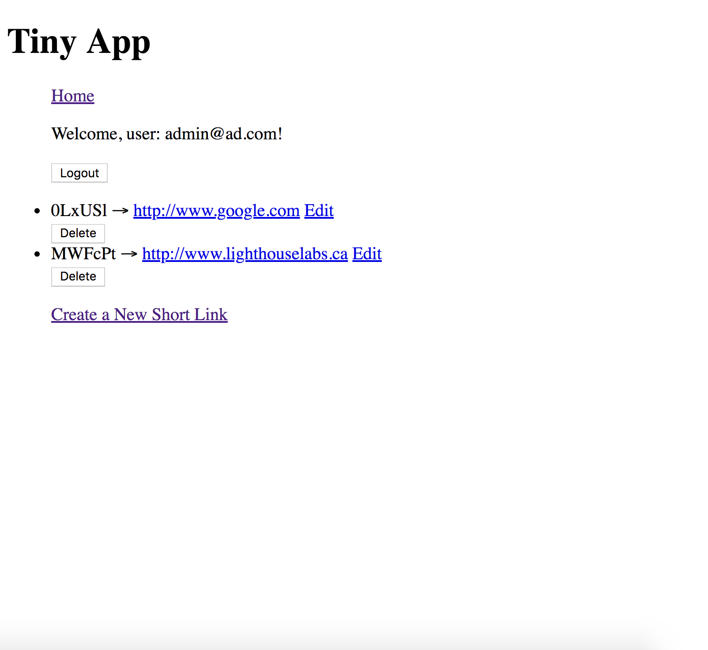
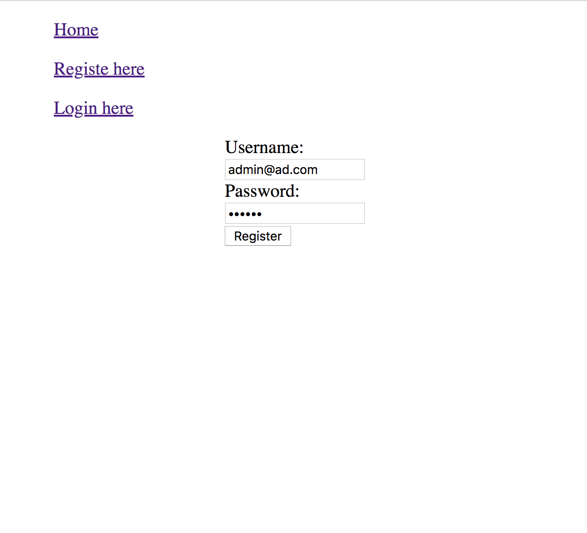
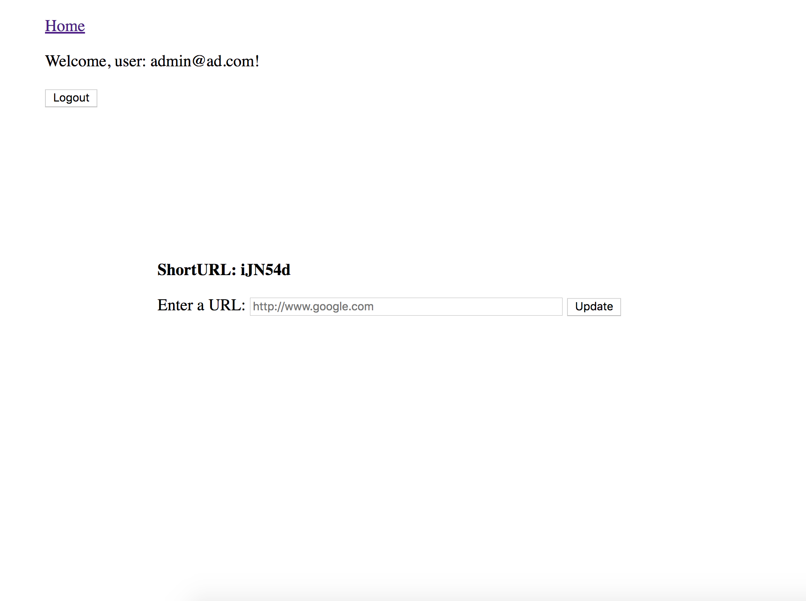

# tinyApp_Project

TinyApp is a full stack web application built with Node and Express that allows users to shorten long URLs

## Final Product

## Dependencies

- Node.js
- Express
- EJS
- bcrypt
- body-parser
- cookie-sessio n

## Getting Started

- Install all dependencies (using the `nom install` command).
- Run the development web server using the `node express_server.js` command
