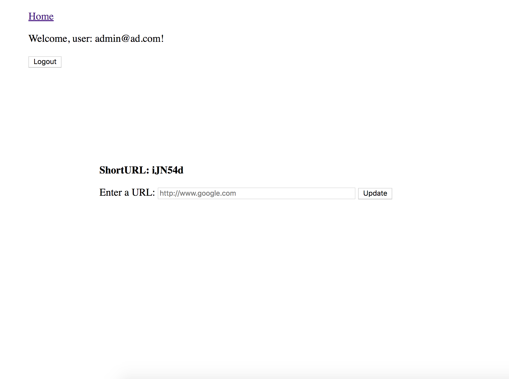

# tinyApp_Project

TinyApp is a full stack web application built with Node and Express that allows users to shorten long URLs

## Final Product

### The main page of the website, which lists all the shortenURL-URL pairs

### The Register page

### The Edie page allows log-in user to edit the URL they create and update shortenURL-URL pair

## Dependencies

- Node.js
- Express
- EJS
- bcrypt
- body-parser
- cookie-sessio n

## Getting Started

- Install all dependencies (using the `nom install` command).
- Run the development web server using the `node express_server.js` command

## Creator

- Eric Zhao
